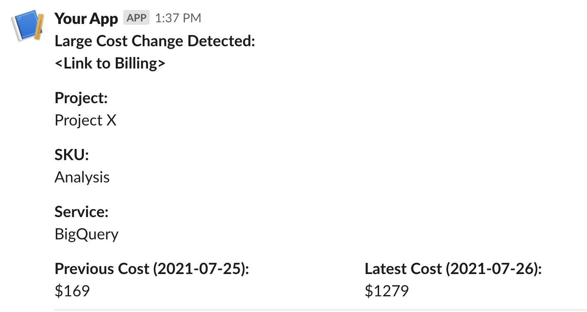

# Cost Alerts

Publish alerts daily on a per service basis to a slack channel when any large percentage cost increase or decrease occurs.



## Written Tutorial

[Tutorial](https://engineering.premise.com/tutorial-cost-spike-alerting-for-google-cloud-platform-gcp-46fd26ae3f6a)

## Install

* pip install goblet-gcp

## Prerequisites 

* GCP Account
* Python environment (>3.7) 
* Gcloud cli 
* Slack Webhook

## Setup

* Set the following varibles in `.goblet/config.json`

    * "SLACK_WEBHOOK"
    * "BILLING_ORG"
    * "BILLING_ID"
    * "BQ_TABLE
    * "SERVICE_ACCOUNT_EMAIL" 

## Deploy 

* run ```goblet deploy --project=PROJECT --location LOCATION```