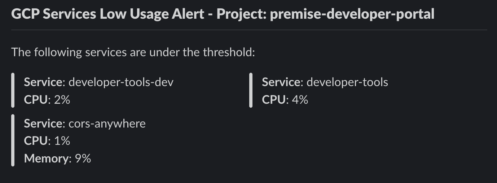

# Goblet GCP Metrics Slack Alerts
This code sets up a scheduled job that checks the CPU and memory utilization of services in Google Cloud Platform (GCP) projects and sends a Slack message for any service that is under a defined utilization threshold.

## Written Tutorial 
[Tutorial](https://engineering.premise.com/tutorial-low-usage-alerting-on-slack-for-google-cloud-platform-gcp-cc68ac8ca4d)

## Prerequisites
- Python 3.7 or later
- A GCP project with active services
- A Slack webhook URL for sending messages

## Installation
1. Clone this repository.
2. Install the required packages using the following command:
```
pip install -r requirements.txt
```

## Usage
You can run this project with `goblet local` setting up the required environment variables:

- `CLOUDRUN_CPU_MIN_THRESHOLD`
- `CLOUDRUN_MEMORY_MIN_THRESHOLD`
- `SLACK_CHANNEL_ID`
- `CRON_EXPRESSION`
- `SLACK_BOT_TOKEN`

## Preview
